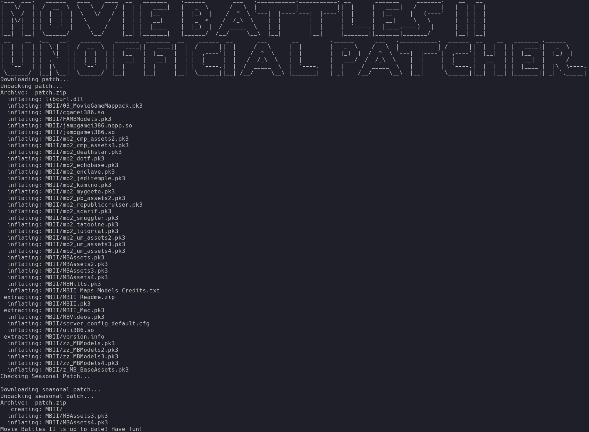

# Movie_Battles_II_Unofficial_Patcher
Patch Movie Battles II with Python instead of installing .NET Core

## Dependencies
This script was written for Python 3. You also need to install html5lib and requests packages.
 ```
 pip install html5lib
 pip install requests
 ```

## Usage
To update the game, run the following command
```
python mb_update.py --dir=<path to Jedi Academy Game Data directory> 
```
To Install the game, run the following command
```
python mb_update.py --install --dir=<path to Jedi Academy Game Data directory> 
```

## Example Output

